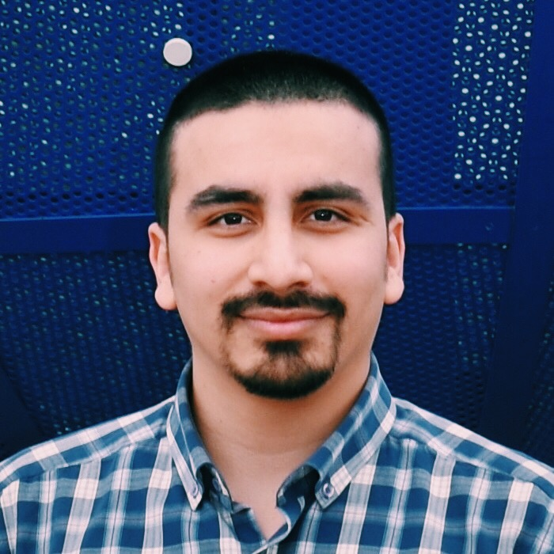

I am a PhD student under supervion of [S. Cenk Sahinalp](https://www.soic.indiana.edu/all-people/profile.html?profile_id=291) working in [Bioinformatics and Computational Genomics Lab](http://www.iu.edu/~compgen/index.html) at the [Indiana University Bloomington](https://www.indiana.edu). I have a broad set of interests within Bioinformatics, Computational Biology, Machine Learning and Data Mining.

I completed [my Master’s](http://library.sharif.ir/parvan/resource/444343/یادگیری-پیرایش-دگرسان-از-داده-های-توالی-یابی-آر--ان--ای/&from=search&&query=farid%20rashidi%20mehrabadi&count=20&execute=true) at the [Sharif University of Technology](http://www.en.sharif.edu) where I worked on Learning of [Alternative Splicing](https://en.wikipedia.org/wiki/Alternative_splicing), supervised by [S. Abolfazl Motahari](http://sharif.edu/~motahari/) and [Hamid R. Rabiee](http://sharif.edu/~rabiee/). I received my Bachelor’s degree from [Amirkabir University of Technology (Tehran Polytechnic)](http://aut.ac.ir/aut/) in Iran.

Office: 2033F, [Luddy Hall](https://goo.gl/maps/9mtD9Cgj4fT2)  
Email: frashidi AT iu DOT edu

  

## News
  * **July 2018**, New pre-print on bioRxiv: [PhISCS](https://www.biorxiv.org/content/early/2018/07/25/376996)
  * **July 2018**, Participating in [CGSI](http://computationalgenomics.bioinformatics.ucla.edu) program at UCLA